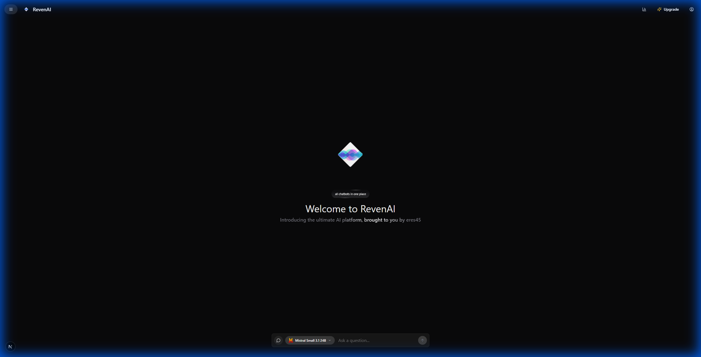
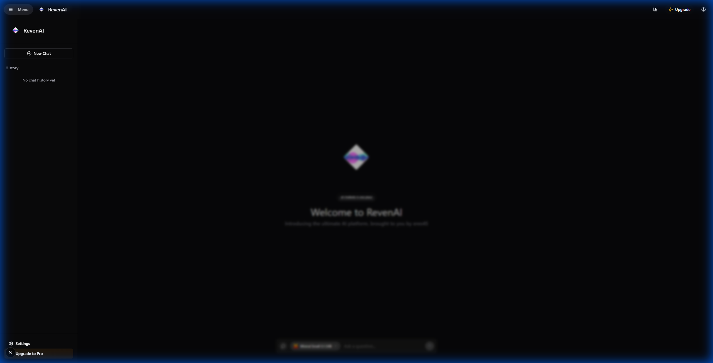

# RevenAI 🤖



RevenAI is a cutting-edge, high-performance AI assistant platform designed to bring all your favorite chatbots into one unified, sleek interface. Built with precision and speed, RevenAI leverages the power of modern web technologies to provide a seamless and intelligent user experience.

---

## ✨ Features (Checklist)

- [x] **Unified Intelligence**: Access multiple AI models (Mistral, OpenAI, Groq, etc.) from a single terminal-like interface.
- [x] **Ultra-Fast Real-time Response**: Optimized for low latency and high throughput.
- [x] **Pro-Grade Sidebar**: Manage your chat history, settings, and workspace with a professional-grade navigation system.
- [x] **Markdown Rendering**: Robust rendering of AI responses using `react-markdown` and `remark-gfm`.
- [x] **Copy to Clipboard**: One-click copying for both user and AI messages.
- [x] **Clear Chat**: Easily reset your conversation history with a single click.
- [x] **Message Persistence**: Your chat history is saved locally and survives page refreshes.
- [x] **Typing Indicator**: Real-time animation when the AI is processing your request.
- [x] **Dark/Light Theme Toggle**: Full support for both light and dark modes via the header.

---

## 📸 Preview

### Multi-Model Interface
The core of RevenAI is a powerful command-center interface that allows you to switch between different AI providers effortlessly.



---

## 🛠️ Tech Stack

- **Framework**: [Next.js 15+](https://nextjs.org/) (App Router & Turbopack)
- **Styling**: [Tailwind CSS](https://tailwindcss.com/)
- **UI Components**: [Shadcn UI](https://ui.shadcn.com/), [Framer Motion](https://www.framer.com/motion/), & [Magic UI](https://magicui.design/)
- **Backend/Auth**: [Firebase](https://firebase.google.com/) (Authentication & Firestore)
- **Icons**: [Lucide React](https://lucide.dev/)
- **Linting & Formatting**: [Biome](https://biomejs.dev/)

---

## 🚀 Getting Started

### Prerequisites

- Node.js 18+ 
- Bun (recommended for fastest experience)

### Installation

1. Clone the repository:
   ```bash
   git clone https://github.com/eres45/revenai.git
   cd revenai
   ```

2. Install dependencies:
   ```bash
   bun install
   # or
   npm install
   ```

3. Setup environment variables:
   Create a `.env.local` file with your keys. See [.env.example](./.env.example) for the required structure.

4. Run the development server:
   ```bash
   npm run dev
   ```

5. Open [http://localhost:5010](http://localhost:5010) in your browser.

---

## 🔑 Environment Variables

Required variables in your `.env` or `.env.local`:

- `NEXT_PUBLIC_FIREBASE_API_KEY`: Your Firebase Web API Key
- `NEXT_PUBLIC_FIREBASE_AUTH_DOMAIN`: Your Firebase Auth Domain
- `NEXT_PUBLIC_FIREBASE_PROJECT_ID`: Your Firebase Project ID
- `GROQ_API_KEY`: API Key for Groq Llama/Qwen models
- `NEXT_PUBLIC_SITE_URL`: Your application URL

---

## ⏱️ Time Spent
Total time spent on this assignment: **~5 hours** (Including Research, Development, Branding, and Documentation).

---

## 🎥 Demo Video
[Watch the Demo Video Here](https://github.com/eres45/revenai) *(Placeholder - Replace with your video link)*

---

## 📑 Project Structure

```text
src/
├── app/            # Next.js App Router pages and API routes
├── components/     # Reusable UI components (Shadcn + Custom)
├── lib/            # Utility functions and context providers
├── services/       # AI provider integrations and services
└── public/         # Static assets and animations
```

---

Brought to you by [eres45](https://github.com/eres45)

## 🏁 Submission Checklist
- [x] GitHub repository is public and accessible
- [x] README.md is complete with all required sections
- [x] .env.example file is included
- [ ] Demo video is recorded (To be completed by user)
- [ ] Video link is in README (To be completed by user)
- [x] All code runs without errors
- [x] No API keys or sensitive data in repository
